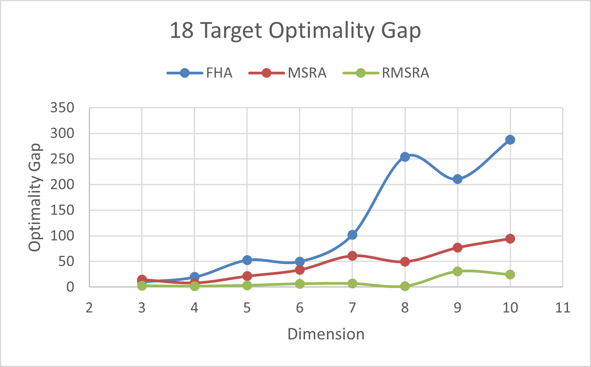
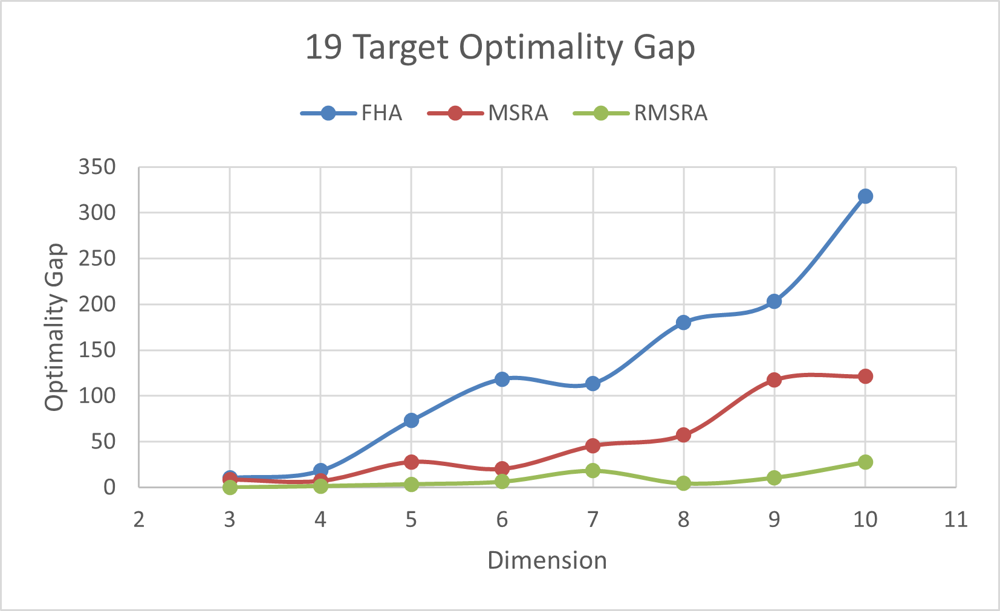
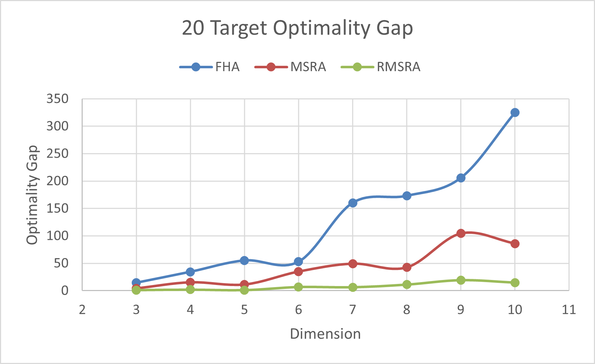
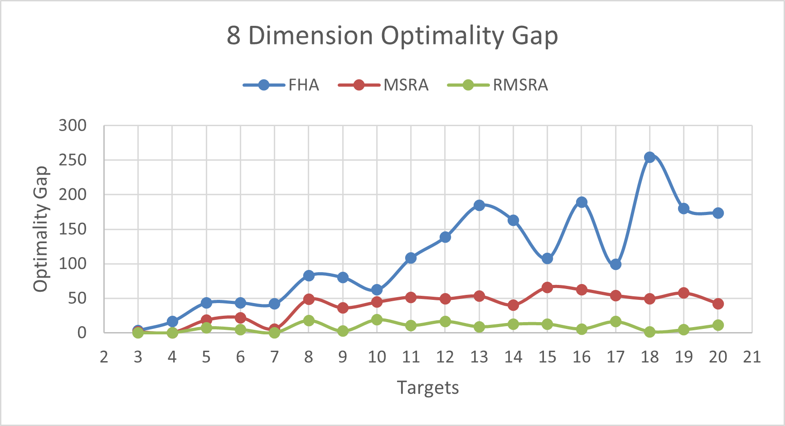
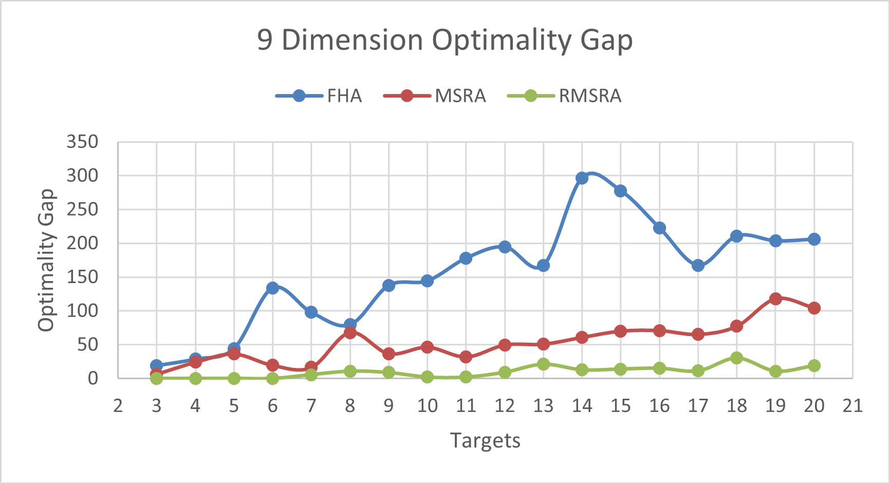
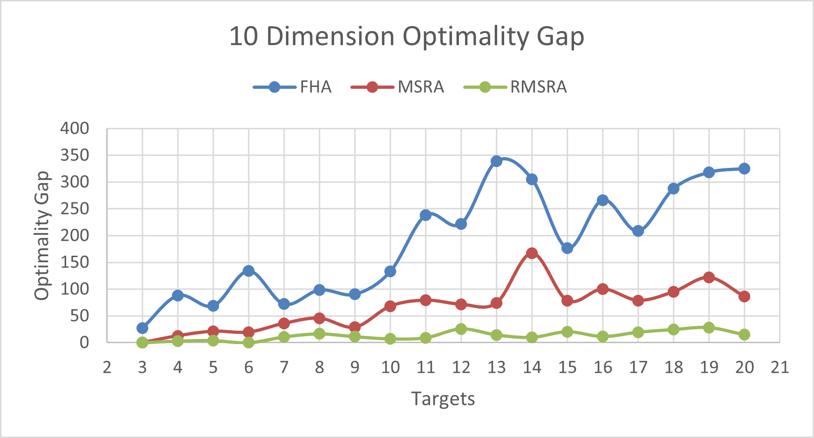

[](https://pubsonline.informs.org/journal/ijoc)

# Code Repository for Computational Framework for Target Tracking Information Fusion Problems
This code repository is for the Computational Framework for Target Tracking Information Fusion Problems by T. Yang, J. Liu, T. Faiz, C. Vogiatzis, and Md. Noor-E-Alam. All the data and code used in the paper will be provided in both Jupiter Notebook and Python format. Linear programming presented in the paper is solved by Gurobi. Users may be able to reproduce all the results presented in the paper and perform further testing by following the instructions. 

## Cite

To cite the contents of this repository, please cite both the paper and this repo.
T. Yang, J. Liu, T. Faiz, C. Vogiatzis, and Md. Noor-E-Alam (2024) Computational Framework for Target Tracking Information Fusion Problems. INFORMS Journal on Computing.

Below is the BibTex for citing this snapshot of the repository.

```
@misc{CacheTest,
  author =        {T. Yang, J. Liu, T. Faiz, C. Vogiatzis, and Md. Noor-E-Alam},
  publisher =     {INFORMS Journal on Computing},
  title =         {{Computational Framework for Target Tracking Information Fusion Problems}},
  year =          {2024},
  url =           {https://github.com/INFORMSJoC/2023.0016},
  note =          {Available for download at https://github.com/INFORMSJoC/2023.0016},
}  
```


## Description
The goal of this software is to demonstrate the results of Single-source and Multi-source Methods Results of the Target Tracking Information Fusion Problems. User may use the software to obtain the results from the single-source problems first and then move on to the multi-source target tracking problems.

## Building
All the software in this repository was developed based on Python. During the development, the software was separated into 2 formats, Jupiter Notebook and Python.

The Jupiter Notebook source files for all methods described in the paper is available in the src/Jupiter_Code subfolder of this repository. 
The Jupiter Notebook test files for all methods described in the paper is available in the script/Jupiter_Code subfolder of this repository. 

*Jupiter Notebook version used:*
- Jupiter Notebook version 6.5.2 in Anaconda Distribution version 2.3.1

The Python source files for all methods described in the paper is available in the src/Python_Code subfolder of this repository. 
The Python test files for all methods described in the paper is available in the script/Python_Code subfolder of this repository. 

*Python version used:*
- Python version 3.12.0

*Python packages required to run the code:*
- numpy
- pandas
- struct
- os
- gurobipy
- time
- scipy
- matplotlib
- xlsxwriter
- itertools

*Gurobi version used*
- Gurobi version 9.0.2

**Before trying to run any of the files in your environment please make sure that all the paths point to the correct folders, paste the data under the corresponding relative path, and go over the function comments in the code.**

## Results
Figure 8 in the paper shows the Optimality gaps for 18, 19, and 20 targets among 3 to 10 numbers of sensors.





Figure 9 in the paper shows the Optimality gaps for 8, 9, and 10 sensors with 3 to 10 numbers of targets.





Tables 2-10 in the paper can be reviewed under the results folder.

## Replicating
### To reproduce Data Generation
* Run: src/Python Code/Data Generation.py, or src/Jupiter Code/Data_Generation.ipynb
* Note:
  * Dimensions, Distributions, and Scales for the generated data can be controlled in the code file.
  * All the uniform distributions should be scaled non-negative.
  * Users should prepare the relative paths before running the Data Generation files. 
  * Generated Data Files will be saved in the user-chosen folder in the saveDatatoFile and saveDistoFile functions.
  * All data used in the manuscript are held in the data folder under the subfolders with the corresponding distribution names.

### To reproduce Single-source Methods Results alone
* Run: src/Python Code/single_source_algo.py, or src/Jupiter Code/single_source_algo.ipynb
* Note:
  * Dimensions, Distributions, and Scales for the input data can be controlled in the code file.
  * Under medium dimensions (10 sensors/stages, 20 targets), LP will face computational difficulties.
  * Under large dimensions (over 30 sensors/stages, 30 targets), LP will not be able to solve in a reasonable time, and RMSRA will take a longer time to solve. 
  * User should un/comment the print statement to review the results for corresponding methods.
  * User should use this to reproduce the single-source results from Table 1 to Table 5, Figure 8, and Figure 9 in the manuscript. All of these including tables and figures can also be checked from the result_smallest_0_100.xlsx under the results folder.

### To reproduce Multi-source Methods Results with Single-source Methods
* Run: scripts/Python Code/test_algos.py, or scripts/Jupiter Code/test_algos.ipynb
* Note:
  * Dimensions, Distributions, and Scales for the input data can be controlled in the code file.
  * For single-source tests, please refer to the previous instruction on computational difficulties among LP and RMSRA.
  * For multi-source tests, all the input information should match with the corresponding outputs of the single-source methods. 
  * User should un/comment the print statement to review the results for corresponding methods.
  * User should put all the source code from the src folder under the same directory with the same format test_algos file (either Python or Jupiter Notebook).
  * Test_algos files in both formats have another copy under the src folder.
  * User should use this to reproduce the multi-source results from Table 7 to Table 9 in the manuscript. All of these including tables and figures can also be checked from the result_smallest_0_100.xlsx and further test.xlsx under the results folder.
  
### To reproduce Noisy Situation Testing
* Run: scripts/Python Code/noise_test.py, or scripts/Jupiter Code/noise_test.ipynb
* Note:
  * Dimensions, Distributions, and Scales for the input data can be controlled in the code file.
  * For single-source noisy tests, users may select path-based or clique-based formulation besides the input data control
  * For multi-source tests, CBSNMF can work with multiple similarity matrices and regularization matrices.
  * User should un/comment the print statement to review the results for corresponding methods.
  * User should put all the source code from the src folder under the same directory with the same format noise_test file (either Python or Jupiter Notebook).
  * test_algos files in both formats have another copy under the src folder.
  * User should use this to reproduce the noisy dataset results from Table 10 in the manuscript. All of these including tables and figures can also be checked from the noise_result.xlsx under the results folder.
